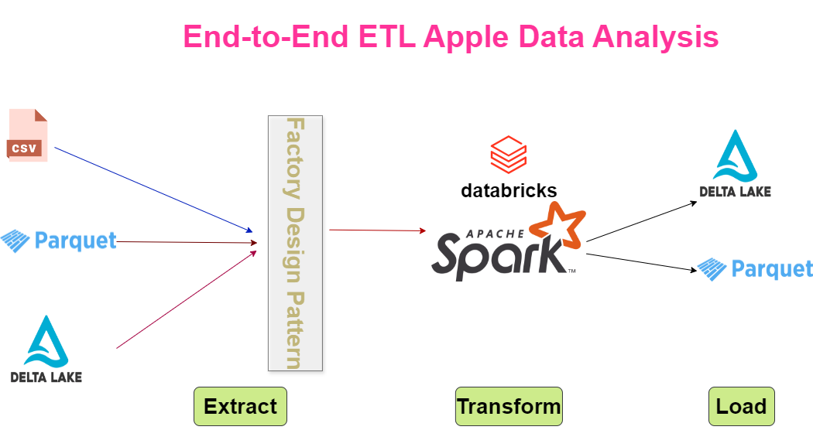

# End To End ETL Apple Transaction Data Analysis
# Architecture Diagram

## Tools and Technologies
* Pyspark
* Databricks
## ETL(Extract,Transform and Load)
### Extract
- Data has been extracted from different sources like CSV,Parquet,Data lake using Pyspark
- Used Factory Method Design Pattern for creating reader objects effectively and promoting loose coupling
### Transform
- Implemented various data cleansing actitvities
- Did the business logic analysis using pyspark functions
- The following are the use cases implemented
  * **Identify customers who purchased both iPhone and AirPods** 
  * **Find customers who bought only iPhone and AirPods nothing else** 
  * **List products bought after initial purchase**
  * **Calculate average time delay between iPhone and Airpod purchases**
  * **Determine top 3 selling products in each category**
### Load
The analysed data has been loaded into the delta lake tables and parquet formats for business.
## Conclusion
This project solidifies the understanding of adavaned concepts of Pyspark Dataframe API like bucketing,partitioing,broadcast joins etc.
